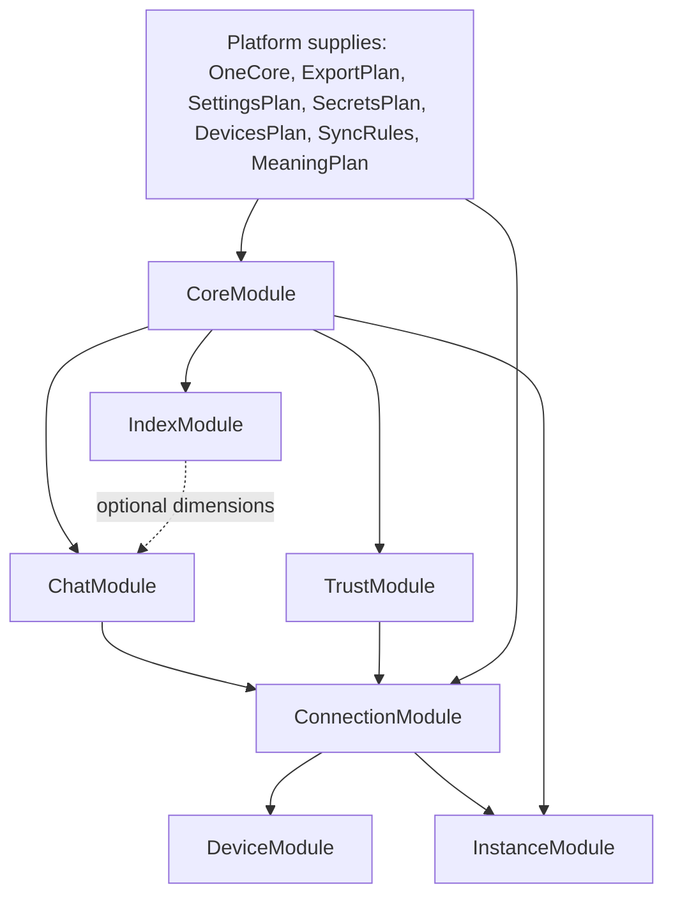

# fotos.expo `vger.core` Module Cut

This is the practical companion to [vger-core-modules.md](/Users/gecko/src/fotos/fotos.expo/docs/vger-core-modules.md).

Status: implemented for fotos mobile. `fotos.expo` now imports the `mobile-library` initializer entrypoint instead of the full `initializeModules(...)` entrypoint.

The inventory doc answers "what exists in `vger.core`?"

This doc answers the more useful question for fotos mobile:

"Which modules are we initializing today, which ones actually form the fotos runtime backbone, and which ones should move behind an initializer profile instead of riding along by default?"

## Source of truth

- `/Users/gecko/src/fotos/fotos.expo/ios-ui/Model.ts`
- `/Users/gecko/src/fotos/fotos.expo/ios-ui/modules/index.ts`
- `/Users/gecko/src/vger/packages/vger.core/src/initialization/initializeModules.ts`
- `/Users/gecko/src/vger/packages/vger.cube/one.md`

## What fotos.expo initializes today

`fotos.expo` currently uses the shared `initializeModules(...)` entrypoint from `vger.core`, then adds three platform modules through `additionalModules`.

That means the app currently initializes 20 modules:

### Shared modules from `initializeModules(...)`

1. `CoreModule`
2. `IndexModule`
3. `AIModule`
4. `ChatModule`
5. `TrustModule`
6. `TrustPdfModule`
7. `ConnectionModule`
8. `AnalysisModule`
9. `MemoryModule`
10. `KnowledgeNavigatorModule`
11. `AgentAssistantModule`
12. `AgentCapabilityModule`
13. `JournalModule`
14. `Phase2WritebackModule`
15. `OrchestrationModule`
16. `PlanAutomationModule`
17. `InstanceModule`

### Platform-added modules from `fotos.expo`

18. `DeviceModule`
19. `MCPModule`
20. `LocalModelModule`

### Modules that are not initialized in the current fotos runtime

- `WorkspaceFilesModule`
  Reason: no `fileSystemOps` or `workspaceRoot` are supplied on Expo.
- `CodingModule`
  Reason: no `GitSourceService` is supplied.
- `BaileysModule`
  Reason: `disableWhatsApp: true` is set in `Model.ts`.

## What fotos.expo binds directly after init

Even though 20 modules are initialized, the model only binds this subset as required runtime surfaces:

- `CoreModule`
- `IndexModule`
- `TrustModule`
- `JournalModule`
- `AnalysisModule`
- `MemoryModule`
- `KnowledgeNavigatorModule`
- `ChatModule`
- `AIModule`
- `ConnectionModule`
- `DeviceModule`
- `MCPModule`
- `InstanceModule`
- `LocalModelModule`

That is an important split:

- some modules are explicitly consumed by `fotos.expo`
- some modules exist mainly because the shared initializer still assumes a fuller `vger` runtime

## Backbone for mdns, QUICVC, CHUM, and user management

For the runtime spine the user asked for, the essential path is much smaller than the current 20-module set.

Read that graph as the actual fotos backbone:

- `CoreModule`
  Supplies `LeuteModel`, `ChannelManager`, `TopicModel`, and `Settings`.
- `IndexModule`
  Adds the contact/topic dimensions that make people and topic lookups practical.
- `TrustModule`
  Gives us trust state for devices and peers.
- `ChatModule`
  Supplies `ChatPlan`, `GroupPlan`, and `ChatTrieManager`, which `ConnectionModule` relies on.
- `ConnectionModule`
  Owns the sync and pairing center of gravity: discovery, CHUM, peer connection state, and transport matching.
- `DeviceModule`
  Turns `DiscoveryService` into device-oriented plans.
- `InstanceModule`
  Builds the IoM/IoP view the app needs for "my devices", contact devices, and local/remote instance visibility.

This backbone is what supports:

- mDNS advertisement and discovery
- QUICVC capability advertisement and transport selection
- CHUM sync lanes
- local-device and peer-device surfaces
- trust-aware user and instance management

## Recommended cut by phase

### Phase A: transport and identity shell

Keep these from day one:

- `CoreModule`
- `IndexModule`
- `TrustModule`
- `ChatModule`
- `ConnectionModule`
- `DeviceModule`
- `InstanceModule`

Also keep the shared non-module supplies already used by the current model:

- `SettingsPlan`
- `SecretsPlan`
- `DevicesPlan`
- `SyncRules`
- `ExportPlan`

This is the minimum honest cut for:

- login and per-user storage
- local-device registration
- mDNS discovery
- QUICVC-capable peer advertisement
- CHUM-backed connection state
- trust and instance views

### Phase B: fotos library and enrichment runs

Add these when fotos starts doing ingest, analysis, enrichment, and trusted sharing as first-class app flows:

- `JournalModule`
- `AnalysisModule`
- `AIModule`
- `MemoryModule`
- `KnowledgeNavigatorModule`
- `LocalModelModule`

Why this set:

- `JournalModule` gives us assembly and event recording instead of opaque side effects.
- `AnalysisModule` supplies `TopicAnalysisModel`, which both AI and memory flows already expect.
- `AIModule` supplies the AI plans, assistant plan, and settings-backed model configuration.
- `MemoryModule` supplies ingestion, recall, semantic trie, and chat-memory surfaces.
- `KnowledgeNavigatorModule` turns analysis + meaning + memory into retrieval and subject-memory flows.
- `LocalModelModule` is the iOS-specific bridge for on-device model runs.

This is the right place for fotos "runs" if "runs" means:

- import a library item
- analyze or enrich it
- build or update manifests
- prepare trusted sharing state

### Phase C: defer behind explicit profiles

These modules are real, but they do not need to be in the first fotos mobile bootstrap profile:

- `TrustPdfModule`
- `MCPModule`
- `AgentAssistantModule`
- `AgentCapabilityModule`
- `Phase2WritebackModule`
- `OrchestrationModule`
- `PlanAutomationModule`
- `WorkspaceFilesModule`
- `CodingModule`
- `BaileysModule`

Notes:

- `TrustPdfModule` is harmless but not part of the mDNS/QUICVC/CHUM/mobile library spine.
- `MCPModule` is small, but it is still optional unless fotos mobile is actively driving remote MCP demand flows.
- `AgentAssistantModule`, `AgentCapabilityModule`, `Phase2WritebackModule`, `OrchestrationModule`, and `PlanAutomationModule` belong to the broader executable-plan and coding-agent world. They are not required for the transport and user-management backbone.
- `WorkspaceFilesModule` and `CodingModule` are host-runtime concerns, not Expo-mobile concerns.
- `BaileysModule` is already disabled and should stay separate.

## The current mismatch

Right now `fotos.expo` is shaped like a mobile shell, but `initializeModules(...)` still defaults to a broad `vger` runtime.

That mismatch is why the app currently pays for modules that are:

- not directly used by the UI
- tied to richer AI or orchestration stories
- more likely to pull in fragile dependency edges during Metro bundling

In other words, the app is currently more prepared than minimal, but not yet intentionally profiled.

## Practical next move

The clean next step is to split shared initialization into explicit profiles instead of one default "full VGER" graph.

Suggested profiles:

1. `mobile-backbone`
   - `CoreModule`
   - `IndexModule`
   - `TrustModule`
   - `ChatModule`
   - `ConnectionModule`
   - `InstanceModule`
   - `DeviceModule`

2. `mobile-library`
   - everything in `mobile-backbone`
   - `JournalModule`
   - `AnalysisModule`
   - `AIModule`
   - `MemoryModule`
   - `KnowledgeNavigatorModule`
   - `LocalModelModule`

3. `full-vger`
   - current default shared graph, including the orchestration and automation family

That would let fotos mobile keep the `vger.expo` initialization structure while stopping short of importing the whole `vger.core` worldview on every bootstrap.
